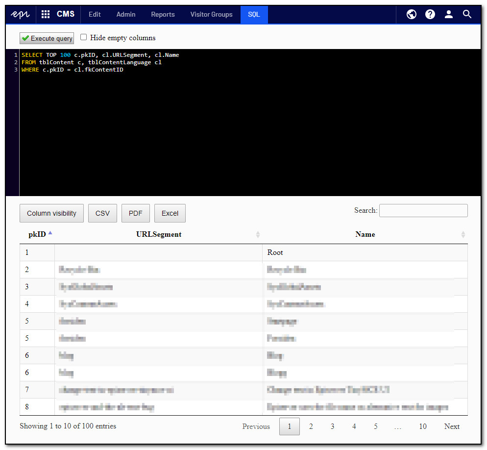
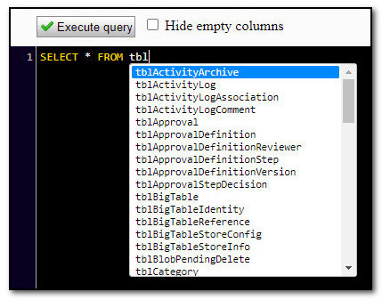

# Gulla.Episerver.SqlStudio

## Intro
This addon will let you query the database directly from Episerver user interface. The result Innnset can be exported to Excel, CSV or PDF.



## Warning
With great powers comes great responsibility! This addon will indeed provide great powers. Delegate and use them wisely, and with caution. The addon should not be enabled for users you would not trust with full access to your database, and it is probably not wise to enable it in production. There is litterally not limts to what you can to with this addon.

## IntelliSense / AutoComplete
Autocomplete is added for all tables in the database, both Episerver tables and any custom tables you might have. The IntelliSense function will trigger after every key-up, with exception for som special keys. The IntelliSense popup can be closed with [ESC].

InstelliSense will show SQL keywords, table names and columns from the last tablename you entered.

Automatically displaying InstelliSense on every key-up can be disabled with this appsetting.
``` XML
<add key="Gulla.Episerver.SqlStudio:AutoIntelliSense.Enabled" value="false" />
```

You can allways trigger IntelliSense with [CTRL] + [SPACE].

 

## Access control and configuration
The addon is only available for users in the group `SqlAdmin`. Other users will be blocked, and will not be able to see the addon's menu item or access it in any other way. The addon can also be completely disabled for specific environments by adding the following to your appsettings. If disabled by appsettings, the addon will not be available for users in the group `SqlAdmin` either.
``` XML
<add key="Gulla.Episerver.SqlStudio:Enabled" value="false" />
```

## Saving queries
To save queries for later, first create a new table. You can do this from within the module. The name of the table and columns must match.
``` SQL 
CREATE TABLE SqlQueries (
	Name varchar(256) NOT NULL,
	Category varchar(256) NOT NULL,
	Query varchar(2048) NOT NULL,
 CONSTRAINT PK_SqlQueries PRIMARY KEY CLUSTERED (Name, Category))
```

Then simply add queries to that table (using SQL). Two queries with identical categories will be placed in the same named dropdown list. Example of adding a query named `All` to the category `Content`:
``` SQL
INSERT INTO SqlQueries VALUES('All', 'Content', 'SELECT * FROM tblContent')
```

In order to insert queries with `'`, simply double them (`''`). Example:
``` SQL
INSERT INTO SqlQueries VALUES('Jpg-images', 'Content', 'SELECT * FROM tblContentLanguage WHERE URLSegment LIKE ''%.jpg''')
```

Will save the query following query:
``` SQL
SELECT * FROM tblContentLanguage WHERE URLSegment LIKE '%.jpg'
```

Saved queries will be displayed by category like this:


## Dependencies
- [CodeMirror](https://codemirror.net/) is used for the editor.
- [DataTables](https://datatables.net/) is used for displaying the result.