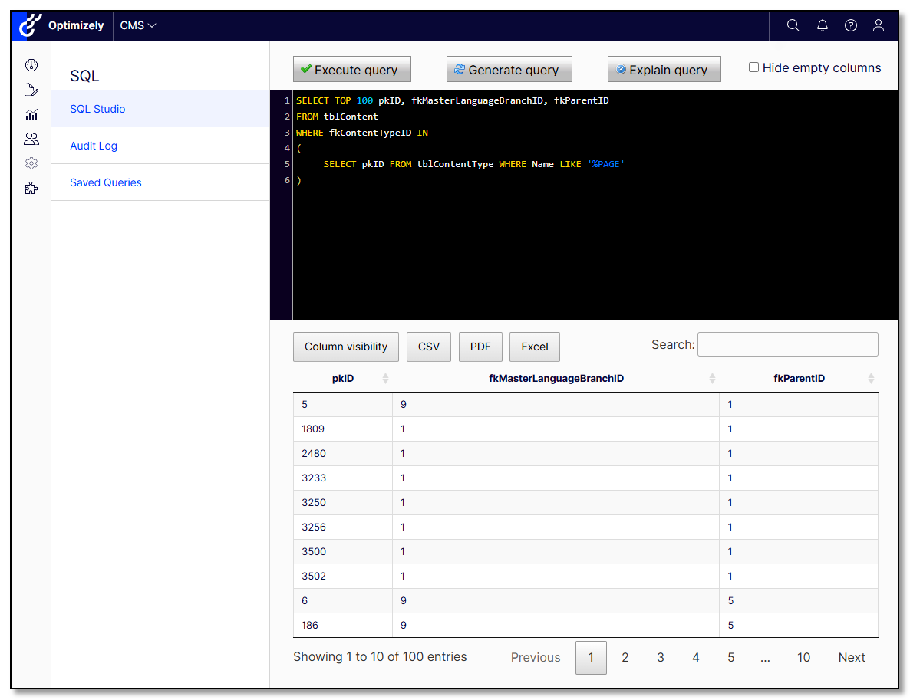
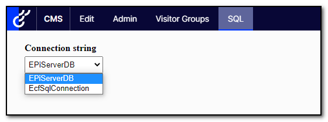

# Gulla.Episerver.SqlStudio for CMS 12

This is the readme for the CMS 12 version, the version for CMS 11 is [over here](https://github.com/tomahg/Gulla.Episerver.SqlStudio/tree/main).

## Warning
With great powers comes great responsibility! This addon will indeed provide great powers. Delegate and use them wisely, and with caution. The addon should not be enabled for users you would not trust with full access to your database, and it is probably not wise to enable it in production. There are literally no limits to what you can do with this addon unless you correctly [configure the limits](#a-safety-net).

## Usage
This addon will let you query the database directly from the Optimizely/Episerver user interface. The result set can be exported to Excel, CSV or PDF.

Enter your query and execute it with the execute button, just like in Microsoft SQL Management Studio.



## Installation
The command below will install SqlStudio in your Optimizely project.
``` 
dotnet add package Gulla.Episerver.SqlStudio
```

## Configuration
For SqlStudio to work, you will have to call the `.AddSqlStudio()` extension method in the Startup.ConfigureServices method. This method provides a configuration with default values. In order for the SqlStudio menu item to show up, you have two options:
* Add your user to the group `SqlAdmin`
* Add your user to the `User` configuration setting

Below is a code snippet with all possible configuration options:
``` csharp
.AddSqlStudio(x => {
    x.AllowMessage = "Your options are very limited!";
    x.AllowPattern = "SELECT TOP \\d{1,3} \\* FROM tblContent";
    x.AutoIntellisenseEnabled = true;
    x.DarkModeEnabled = true;
    x.DenyMessage = "Careful, please!";
    x.DenyPattern = "\\b(DROP|DELETE|UPDATE|ALTER|ADD|EXEC|TRUNCATE)\\b";
    x.Enabled = true;
    x.Users = "Huey,Dewey,Louie"; 
})
```

You can also configure SqlStudio using `appsettings.json`. A configuration setting specified in `appsettings.json` will override any configuration configured in `Startup.cs`. See example below:
``` JSON
  "Gulla": {
    "SqlStudio": {
      "AllowMessage": "Your options are very limited!",
      "AllowPattern": "SELECT TOP \\d{1,3} \\* FROM tblContent",
      "AutoIntellisenseEnabled": true,
      "DarkModeEnabled": true,
      "DenyMessage": "Careful, please!",
      "DenyPattern": "\\b(DROP|DELETE|UPDATE|ALTER|ADD|EXEC|TRUNCATE)\\b",
      "Enabled": true,
      "Users": "Huey,Dewey,Louie"		  
    }
  }
```
## IntelliSense / AutoComplete
IntelliSense is added for all tables in the database, both Episerver tables and any custom tables you might have. The IntelliSense function will trigger after every key-up, with an exception for some special keys. The IntelliSense popup can be closed with [ESC].

IntelliSense will show SQL keywords, table names and columns from the last table name you entered.

Automatically displaying IntelliSense on every key-up can be disabled with this setting.
``` csharp
.AddSqlStudio(x => {
    x.AutoIntellisenseEnabled = false;
})
```

You can always trigger IntelliSense with [CTRL] + [SPACE].


## Connection string switcher
If you have more than one database, i.e both Content Cloud and Commerce Cloud, or Content Cloud and a custom database, you are able to select a connection string. If you change the connection string, the page will reload and IntelliSense for the new database will be activated



## Light mode
The default editor is dark mode, but dark mode can be disabled with the following appsetting.
``` csharp
.AddSqlStudio(x => {
    x.DarkModeEnabled = false;
})
```


## Access control
The addon is only available for users in the group `SqlAdmin`. Other users will be blocked, and will not be able to see the addon's menu item or access it in any other way. The addon can also be completely disabled for specific environments by adding the following to your appsettings. If disabled by appsettings, the addon will not be available for users in the group `SqlAdmin` either.
``` csharp
.AddSqlStudio(x => {
    x.Enabled = false;
})
```

The addon can also be made available to users not in the group `SqlAdmin` by listing their user names like this.
``` csharp
.AddSqlStudio(x => {
    x.Users = "Huey,Dewey,Louie";
})
```

## A safety net
You can control what queries are allowed by providing a regular expression that will be validated (ignore case) against the query prior to execution. Provide a message that is shown if validation fails. Example below.
``` csharp
.AddSqlStudio(x => {
    x.AllowPattern = "SELECT TOP \\d{1,3} \\* FROM tblContent";
    x.AllowMessage = "Your options are very limited!";
})
```

In the same way, you can also control what queries are denied by providing a regular expression. Example below.
``` csharp
.AddSqlStudio(x => {
    x.DenyPattern = "\\b(DROP|DELETE|UPDATE|ALTER|ADD|EXEC|TRUNCATE)\\b";
    x.DenyMessage = "Careful, please!";
})
```

## Saving queries
To save queries for later, first, create a new table. You can do this from within the module. The name of the table and columns must match.
``` SQL 
CREATE TABLE SqlQueries (
	Name varchar(256) NOT NULL,
	Category varchar(256) NOT NULL,
	Query varchar(2048) NOT NULL,
 CONSTRAINT PK_SqlQueries PRIMARY KEY CLUSTERED (Name, Category))
```

Then simply add queries to that table (using SQL). Two queries with identical categories will be placed in the same-named dropdown list. Example of adding a query named `All` to the category `Content`:
``` SQL
INSERT INTO SqlQueries VALUES('All', 'Content', 'SELECT * FROM tblContent')
```

In order to insert queries with `'`, simply double them (`''`). Example:
``` SQL
INSERT INTO SqlQueries VALUES('Jpg-images', 'Content', 'SELECT * FROM tblContentLanguage WHERE URLSegment LIKE ''%.jpg''')
```

Will save the following query:
``` SQL
SELECT * FROM tblContentLanguage WHERE URLSegment LIKE '%.jpg'
```

Saved queries will be displayed by category like this:


## Custom columns

Although SQL might potentially be the optimal way of querying and manipulating your data, sometimes a little help is welcome. Using the inputs for custom columns, it's possible to add two extra columns to your dataset. The columns are calculated from each row.
* The content name
* The content URL

For each of the two columns, you can specify what column from the previous query to use as the content id and (optional) language branch id. Behind the scenes `ContentLoader` will be run for each row, populating the custom column with Name or External URL.

You may specify both the column header name and the placement (first, last, etc).


## Dependencies
- [CodeMirror](https://codemirror.net/) is used for the editor and basic IntelliSense.
- [DataTables](https://datatables.net/) is used for displaying the result, and exporting to CSV, PDF and Excel.

## Contribute
You are welcome to register an issue or create a pull request if you see something that should be improved.